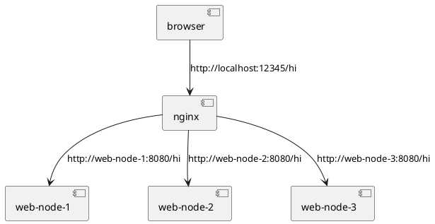

## Пример по курсу Архитектура программных систем

В примере показывается использование библиотеки httplib для построения клиентских и серверных приложений, использующих протокол HTTP

Билиотека: https://github.com/yhirose/cpp-httplib

## Конфигурация nginx

    upstream app {
 
        server web-node-1:8080;
        server web-node-2:8080;
        server web-node-3:8080;
    }
    server {
        listen 80;
        location / {
            proxy_pass http://app;
        }
    }

## Проверка

http://localhost:1234/hi

## Component Architecture

